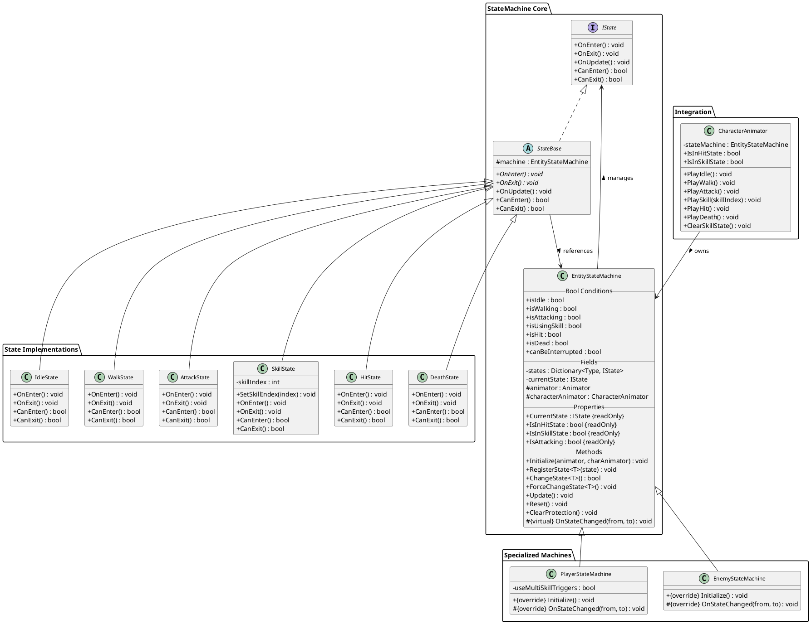

# 需求文档：商业级角色动作有限状态机（FSM）

## 引言

当前所有角色（玩家、小怪、Boss）的动作状态转换逻辑分散在 `CharacterAnimator`、`BTCombat`、`ManualController`、`CombatSystem` 等多个文件中，通过多个布尔标志（`isInHitState`、`isInSkillState`）、枚举（`currentAnimState`）和计时器来模拟状态保护行为。

本次重构将引入一个**商业级有限状态机（Finite State Machine）**来统一管理所有角色的动作状态转换。设计遵循以下原则：

- **继承结构**：`EntityStateMachine`（基类）→ `PlayerStateMachine` / `EnemyStateMachine`（子类）
- **Bool 条件驱动**：所有状态转换条件统一使用 Bool 类型，通过条件组合判断是否允许转换
- **无超时机制**：状态退出完全依赖帧事件回调驱动
- **开闭原则**：新增状态无需修改现有代码，只需添加新的状态类和注册转换规则
- **单一职责**：每个状态类只负责自己的进入/退出/更新逻辑

## 需求

### 需求 1：创建 FSM 核心框架（IState 接口 + StateBase 抽象类）

**用户故事：** 作为开发者，我想要一个通用的状态接口和抽象基类，以便所有状态都遵循统一的生命周期契约，且可以方便地扩展新状态。

#### 验收标准

1. WHEN 系统初始化 THEN 系统 SHALL 定义 `IState` 接口，包含方法：`OnEnter()`、`OnExit()`、`OnUpdate()`、`CanEnter()` → bool、`CanExit()` → bool
2. WHEN 状态需要共享逻辑 THEN 系统 SHALL 提供 `StateBase` 抽象类实现 `IState`，持有对状态机的反向引用（`protected EntityStateMachine machine`）
3. WHEN 状态需要判断是否可以进入 THEN `CanEnter()` SHALL 返回一个 bool 值，基于状态机中的 Bool 条件变量来判断
4. WHEN 状态需要判断是否可以退出 THEN `CanExit()` SHALL 返回一个 bool 值，基于当前状态的保护标志（Bool）来判断
5. WHEN 状态进入时 THEN `OnEnter()` SHALL 设置相关的 Bool 条件为 true（如 `isAttacking = true`）
6. WHEN 状态退出时 THEN `OnExit()` SHALL 清除相关的 Bool 条件（如 `isAttacking = false`）

### 需求 2：创建 EntityStateMachine 基类

**用户故事：** 作为开发者，我想要一个 Entity 状态机基类来管理状态注册、转换逻辑和 Bool 条件变量，以便通用逻辑集中管理。

#### 验收标准

1. WHEN 系统初始化 THEN `EntityStateMachine` SHALL 维护一个状态字典（`Dictionary<Type, IState>`）用于注册和查找状态
2. WHEN 系统初始化 THEN `EntityStateMachine` SHALL 维护一组 Bool 条件变量，用于驱动所有状态转换判断：
   - `isIdle` — 当前是否处于 Idle 状态
   - `isWalking` — 当前是否处于 Walk 状态
   - `isAttacking` — 当前是否处于 Attack 状态（保护期内为 true）
   - `isUsingSkill` — 当前是否处于 Skill 状态（保护期内为 true）
   - `isHit` — 当前是否处于 Hit 状态（保护期内为 true）
   - `isDead` — 当前是否处于 Death 状态
   - `canBeInterrupted` — 当前状态是否可以被打断（Attack/Skill 保护期内为 false）
3. WHEN 外部调用 `ChangeState<T>()` THEN 状态机 SHALL 检查当前状态的 `CanExit()` 和目标状态的 `CanEnter()`，两者都返回 true 时才执行转换
4. WHEN 状态转换被拒绝 THEN 系统 SHALL 静默忽略（不报错），保持当前状态不变
5. WHEN `ForceChangeState<T>()` 被调用 THEN 系统 SHALL 无条件执行状态转换（用于 Death 等最高优先级状态）
6. WHEN 每帧更新 THEN `Update()` SHALL 调用当前状态的 `OnUpdate()` 方法
7. WHEN 状态机需要重置 THEN `Reset()` SHALL 将所有 Bool 条件清零并强制回到 Idle 状态

### 需求 3：创建 PlayerStateMachine 子类

**用户故事：** 作为开发者，我想要一个 Player 状态机子类来处理玩家角色特有的状态逻辑。

#### 验收标准

1. WHEN `PlayerStateMachine` 被创建 THEN 系统 SHALL 继承 `EntityStateMachine` 基类
2. WHEN 初始化时 THEN `PlayerStateMachine` SHALL 注册所有玩家相关的状态实例（Idle、Walk、Attack、Skill、Hit、Death）
3. WHEN 玩家角色只有一个技能 THEN Skill 状态的 `OnEnter()` SHALL 使用 `Skill` Trigger 参数触发动画
4. WHEN 玩家角色有多个技能 THEN Skill 状态的 `OnEnter()` SHALL 使用 SkillOne/SkillTwo/SkillThree/SkillFour Trigger 参数触发对应动画

### 需求 4：创建 EnemyStateMachine 子类

**用户故事：** 作为开发者，我想要一个 Enemy 状态机子类来处理敌人角色（小怪和 Boss）特有的状态逻辑。

#### 验收标准

1. WHEN `EnemyStateMachine` 被创建 THEN 系统 SHALL 继承 `EntityStateMachine` 基类
2. WHEN 初始化时 THEN `EnemyStateMachine` SHALL 注册所有敌人相关的状态实例
3. WHEN Boss 有多个技能 THEN Skill 状态的 `OnEnter()` SHALL 使用 SkillOne/SkillTwo/SkillThree/SkillFour Trigger 参数触发对应动画
4. WHEN 敌人 AI 驱动状态转换 THEN `EnemyStateMachine` SHALL 响应行为树（BTCombat）的状态转换请求

### 需求 5：定义 Bool 条件驱动的状态转换规则

**用户故事：** 作为开发者，我想要所有状态转换条件都使用 Bool 类型来判断，以便逻辑清晰、可调试、可序列化。

#### 验收标准

1. WHEN 角色处于 Idle/Walk 状态（`canBeInterrupted == true`） THEN 系统 SHALL 允许转换到任何其他状态
2. WHEN 角色处于 Attack 状态（`isAttacking == true && canBeInterrupted == false`） THEN 系统 SHALL 仅允许 `ForceChangeState<DeathState>()` 打断
3. WHEN 角色处于 Skill 状态（`isUsingSkill == true && canBeInterrupted == false`） THEN 系统 SHALL 仅允许 `ForceChangeState<DeathState>()` 打断
4. WHEN 角色处于 Hit 状态（`isHit == true`） THEN 系统 SHALL 允许再次进入 Hit（重置动画）和 Death
5. WHEN 帧事件回调触发 THEN 系统 SHALL 将 `canBeInterrupted` 设为 true，允许后续转换
6. WHEN Death 状态被请求 THEN 系统 SHALL 使用 `ForceChangeState<DeathState>()`，无视所有 Bool 条件
7. WHEN 状态转换发生 THEN 系统 SHALL 自动更新所有相关 Bool 条件（退出状态清除旧条件，进入状态设置新条件）

### 需求 6：实现具体状态类

**用户故事：** 作为开发者，我想要每个动作状态都有独立的类实现，以便职责清晰、易于维护和扩展。

#### 验收标准

1. WHEN `IdleState` 进入 THEN 系统 SHALL 设置 `isIdle = true`、`canBeInterrupted = true`，并触发 Idle 动画
2. WHEN `WalkState` 进入 THEN 系统 SHALL 设置 `isWalking = true`、`canBeInterrupted = true`，并触发 Walk 动画
3. WHEN `AttackState` 进入 THEN 系统 SHALL 设置 `isAttacking = true`、`canBeInterrupted = false`，并触发 Attack 动画
4. WHEN `SkillState` 进入 THEN 系统 SHALL 设置 `isUsingSkill = true`、`canBeInterrupted = false`，并触发对应 Skill 动画
5. WHEN `HitState` 进入 THEN 系统 SHALL 设置 `isHit = true`、`canBeInterrupted = false`，并触发 Hit 动画
6. WHEN `DeathState` 进入 THEN 系统 SHALL 设置 `isDead = true`，并触发 Death 动画，且不允许再转换到其他状态
7. WHEN 各状态退出 THEN 系统 SHALL 清除对应的 Bool 标志（如退出 Attack 时 `isAttacking = false`）

### 需求 7：状态机与现有系统的集成

**用户故事：** 作为开发者，我想要状态机无缝替换现有的布尔标志和枚举逻辑，以便 AI 系统、手动操控和战斗系统都能正常工作。

#### 验收标准

1. WHEN `CharacterAnimator` 被重构 THEN 系统 SHALL 将 `isInHitState`、`isInSkillState`、`currentAnimState` 等字段替换为状态机实例
2. WHEN `CharacterAnimator` 初始化时 THEN 系统 SHALL 根据角色类型创建对应的 `PlayerStateMachine` 或 `EnemyStateMachine` 实例
3. WHEN AI 系统查询角色状态 THEN 系统 SHALL 通过状态机的 Bool 属性（`IsInHitState`、`IsInSkillState`、`IsAttacking`）来判断
4. WHEN `CombatSystem.ClearAttackState()` 被调用 THEN 系统 SHALL 将 `canBeInterrupted` 设为 true，允许状态转换
5. WHEN 状态机集成完成 THEN 所有现有的公共接口（`PlayIdle()`、`PlayWalk()`、`PlayAttack()`、`PlaySkill()`、`PlayHit()`、`PlayDeath()`）SHALL 保持不变，内部改为调用状态机的 `ChangeState<T>()`

### 需求 8：保持现有功能行为不变

**用户故事：** 作为开发者，我想要重构后所有角色的行为与重构前完全一致。

#### 验收标准

1. WHEN 玩家角色处于 AI 模式 THEN 系统 SHALL 保持原有的 Wander → Combat → PostCombat 行为不变
2. WHEN 玩家角色处于手动操控模式 THEN 系统 SHALL 保持原有的点击移动、追击、持续攻击行为不变
3. WHEN 小怪 AI 运行 THEN 系统 SHALL 保持原有的巡逻、追击、普通攻击行为不变
4. WHEN Boss AI 运行 THEN 系统 SHALL 保持原有的技能优先、CD 轮转、普通攻击补充的行为不变
5. WHEN 角色受击 THEN 系统 SHALL 保持原有的受击动画播放、闪白、击退行为不变
6. WHEN 角色死亡 THEN 系统 SHALL 保持原有的死亡动画、回收流程不变
7. WHEN 角色释放技能 THEN 系统 SHALL 保持原有的 SkillOne/SkillTwo/SkillThree/SkillFour Trigger 触发逻辑不变

### 需求 9：提供状态机使用文档

**用户故事：** 作为开发者，我想要清晰的状态机使用说明，以便知道如何在新增功能时正确使用状态机。

#### 验收标准

1. WHEN 重构完成 THEN 系统 SHALL 在代码注释中提供状态机的使用说明
2. WHEN 需要新增状态 THEN 文档 SHALL 说明如何创建新的状态类、注册到状态机、定义 Bool 条件
3. WHEN 需要修改转换规则 THEN 文档 SHALL 说明如何调整 `CanEnter()`/`CanExit()` 中的 Bool 条件组合
4. WHEN 需要为新角色类型创建状态机 THEN 文档 SHALL 说明如何继承 `EntityStateMachine` 并重写特定行为

## 技术约束

- 状态机采用继承结构：`EntityStateMachine`（基类）→ `PlayerStateMachine` / `EnemyStateMachine`（子类）
- 所有状态转换条件统一使用 Bool 类型，不使用枚举比较或整数判断
- 状态机作为 `CharacterAnimator` 的内部组件，不需要单独挂载为 MonoBehaviour
- 基类定义通用状态和转换规则，子类通过 override 实现差异化行为
- 每个状态类使用独立文件，放在 `Scripts/Character/StateMachine/States/` 目录下
- 核心框架类放在 `Scripts/Character/StateMachine/` 目录下
- 所有现有的公共 API 保持签名不变，仅内部实现改变
- 状态机不应依赖 Unity Animator 的状态（避免循环依赖），而是作为 Animator 的上层控制器
- 不使用超时安全机制，状态的退出完全依赖帧事件回调来驱动
- 重构应保持向后兼容：如果某些角色的 Animator Controller 缺少某些参数，状态机应优雅降级

## 边界情况

1. 角色在 Attack 状态中被击杀 → `ForceChangeState<DeathState>()` 无条件打断
2. 角色在 Hit 状态中再次受击 → 允许重新进入 Hit（重置动画）
3. 角色在 Walk 状态中同时收到 Attack 和 Skill 请求 → 先到先得（由调用顺序决定）
4. 状态机在角色未初始化时被调用 → 安全返回，不崩溃
5. 对象池回收后重新使用 → 调用 `Reset()` 将状态机重置到 Idle
6. 角色类型未知 → 使用基类 `EntityStateMachine` 的默认行为

## UML 类图



## 状态转换规则表（Bool 条件）

| 当前状态 | 目标状态 | 转换条件（Bool 组合） |
|---------|---------|---------------------|
| Idle | Walk | `canBeInterrupted == true` |
| Idle | Attack | `canBeInterrupted == true` |
| Idle | Skill | `canBeInterrupted == true` |
| Idle | Hit | `canBeInterrupted == true` |
| Idle | Death | 无条件（ForceChange） |
| Walk | Idle | `canBeInterrupted == true` |
| Walk | Attack | `canBeInterrupted == true` |
| Walk | Skill | `canBeInterrupted == true` |
| Walk | Hit | `canBeInterrupted == true` |
| Walk | Death | 无条件（ForceChange） |
| Attack | Idle | `canBeInterrupted == true`（帧事件后） |
| Attack | Walk | `canBeInterrupted == true`（帧事件后） |
| Attack | Death | 无条件（ForceChange） |
| Attack | Hit | 不允许（`isAttacking == true && canBeInterrupted == false`） |
| Skill | Idle | `canBeInterrupted == true`（帧事件后） |
| Skill | Walk | `canBeInterrupted == true`（帧事件后） |
| Skill | Death | 无条件（ForceChange） |
| Skill | Hit | 不允许（`isUsingSkill == true && canBeInterrupted == false`） |
| Hit | Idle | `canBeInterrupted == true`（帧事件后） |
| Hit | Hit | 允许（重新进入，重置动画） |
| Hit | Death | 无条件（ForceChange） |
| Death | 任何 | 不允许（`isDead == true` 时拒绝所有转换） |

## 状态转换流程图

```
┌───────────────────────────────────────────────────────────────────┐
│                    Death (ForceChangeState - 最高优先级)             │
│                   ← 任何状态都可以通过 ForceChange 转换到 Death      │
└───────────────────────────────────────────────────────────────────┘

                    ChangeState (需要 canBeInterrupted == true)
┌─────┐    ChangeState<WalkState>()    ┌─────┐
│Idle │ ◄─────────────────────────────► │Walk │
└──┬──┘    ChangeState<IdleState>()    └──┬──┘
   │                                      │
   │ ChangeState<AttackState>()           │ ChangeState<AttackState>()
   ▼                                      ▼
┌──────┐                              ┌──────┐
│Attack│  canBeInterrupted = false     │Attack│
└──┬───┘                              └──────┘
   │ 帧事件 → ClearProtection() → canBeInterrupted = true
   │ 然后 ChangeState<IdleState>()
   ▼
┌─────┐
│Idle │
└─────┘

┌─────┐    ChangeState<SkillState>()   ┌─────┐
│Idle │ ──────────────────────────────► │Skill│  canBeInterrupted = false
└─────┘                                 └──┬──┘
                                           │ 帧事件 → ClearProtection()
                                           │ 然后 ChangeState<IdleState>()
                                           ▼
                                        ┌─────┐
                                        │Idle │
                                        └─────┘

┌─────┐    ChangeState<HitState>()     ┌───┐
│Idle │ ──────────────────────────────► │Hit│  canBeInterrupted = false
│Walk │  (仅当 canBeInterrupted==true)  └─┬─┘
└─────┘                                   │ 帧事件 → ClearProtection()
                                          │ 然后 ChangeState<IdleState>()
                                          ▼
                                       ┌─────┐
                                       │Idle │
                                       └─────┘
```

## 目录结构

```
Assets/Scripts/Character/StateMachine/
├── IState.cs                    // State interface
├── StateBase.cs                 // Abstract base class
├── EntityStateMachine.cs        // Base state machine with Bool conditions
├── PlayerStateMachine.cs        // Player-specific state machine
├── EnemyStateMachine.cs         // Enemy-specific state machine
└── States/
    ├── IdleState.cs
    ├── WalkState.cs
    ├── AttackState.cs
    ├── SkillState.cs
    ├── HitState.cs
    └── DeathState.cs
```
