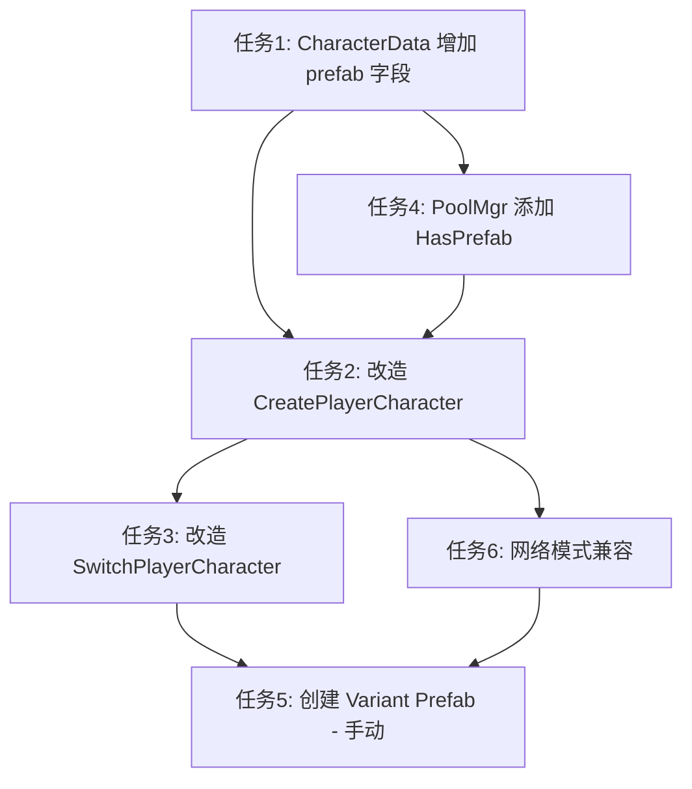

# 任务规划：角色 Variant Prefab 方案

> 对应需求文档：`requirements.md`

---

## 任务总览

| # | 任务 | 涉及文件 | 对应需求 | 依赖 |
|---|------|----------|----------|------|
| 1 | CharacterData 增加 prefab 字段 | `CharacterData.cs` | 需求1 | 无 |
| 2 | 改造 GameCharacterManager.CreatePlayerCharacter | `GameCharacterManager.cs` | 需求4 | 任务1 |
| 3 | 改造 GameCharacterManager.SwitchPlayerCharacter | `GameCharacterManager.cs` | 需求5 | 任务2 |
| 4 | 改造 GameManager 对象池注册逻辑 | `GameManager.cs` | 需求3 | 任务1 |
| 5 | 创建示例 Variant Prefab（手动操作指南） | Unity Editor 操作 | 需求2 | 任务1~4 |
| 6 | 网络模式兼容性处理 | `GameCharacterManager.cs` | 需求7 | 任务2 |

---

## 任务 1：CharacterData 增加 prefab 字段

**目标：** 在 `CharacterData` ScriptableObject 中新增一个 `GameObject prefab` 字段，用于引用该角色的专属 Variant Prefab。

**文件：** `Assets/Scripts/Data/CharacterData.cs`

### 实现步骤

1. 在 `[Header("Visuals")]` 区域之后（或新建一个 `[Header("Prefab")]` 区域），添加字段：

```csharp
[Header("Prefab")]
[Tooltip("Character-specific Prefab Variant. If null, the default PlayerPrefab will be used.")]
public GameObject prefab;
```

2. 添加一个便捷方法，用于获取该角色应使用的 Prefab 名称（供对象池使用）：

```csharp
/// <summary>
/// Returns the prefab name to use for object pool lookup.
/// If a character-specific prefab is assigned, returns its name; otherwise returns null (use default).
/// </summary>
public string GetPrefabName()
{
    return prefab != null ? prefab.name : null;
}
```

### 验证标准
- 编译无错误
- 在 Inspector 中能看到新的 "Prefab" 字段
- 未赋值时 `GetPrefabName()` 返回 null

---

## 任务 2：改造 CreatePlayerCharacter 方法

**目标：** 修改 `CreatePlayerCharacter` 方法，使其优先使用 `CharacterData.prefab` 指定的预制体，回退到默认 `playerPrefabName`。

**文件：** `Assets/Scripts/Character/GameCharacterManager.cs`

### 实现步骤

1. 修改 `CreatePlayerCharacter` 方法开头的实例化逻辑：

```csharp
public CharacterEntity CreatePlayerCharacter(CharacterData data, Vector3 position)
{
    GameObject playerObj = null;
    string prefabKey = data.GetPrefabName();

    if (!string.IsNullOrEmpty(prefabKey))
    {
        // Use character-specific Variant Prefab
        // Ensure it's registered in the pool (lazy registration)
        if (!PoolMgr.Instance.HasPrefab(prefabKey))
        {
            PoolMgr.Instance.SetPrefab(prefabKey, data.prefab);
        }
        playerObj = PoolMgr.Instance.GetNode(prefabKey);
    }
    else
    {
        // Fallback: use default PlayerPrefab
        playerObj = PoolMgr.Instance.GetNode(playerPrefabName);
    }

    if (playerObj == null)
    {
        // Fallback: create a new GameObject if pool doesn't have one
        playerObj = new GameObject($"Player_{data.characterName}");
    }

    // ... rest of the method remains the same ...
}
```

2. 由于 Variant Prefab 已经预配置了碰撞体，保留现有的 Collider2D 检查逻辑（`if (playerObj.GetComponent<Collider2D>() == null)`），这样：
   - Variant Prefab 已有碰撞体 → 不会重复添加 ✓
   - 默认 Prefab 已有碰撞体 → 不会重复添加 ✓
   - 纯 fallback GameObject → 会添加默认碰撞体 ✓

### 验证标准
- `CharacterData.prefab` 有值时，使用对应 Variant Prefab
- `CharacterData.prefab` 为 null 时，回退到 `playerPrefabName`
- 碰撞体不会被重复添加

---

## 任务 3：改造 SwitchPlayerCharacter 方法

**目标：** 修改角色切换逻辑，使旧角色回收到正确的对象池，新角色从正确的 Variant Prefab 实例化。

**文件：** `Assets/Scripts/Character/GameCharacterManager.cs`

### 实现步骤

1. 修改 `SwitchPlayerCharacter` 中销毁旧角色的逻辑，改为回收到对象池：

```csharp
// Destroy or recycle the old character
if (currentEntity != null)
{
    PlayerCharacters.Remove(currentEntity);

    // Unsubscribe death event before recycling
    currentEntity.OnDeath -= OnPlayerCharacterDeath;

    // Recycle to pool using the object's name (which matches its prefab key)
    PoolMgr.Instance.PutNode(currentEntity.gameObject);
}
```

> **说明：** `PoolMgr.GetNode()` 在实例化时会将 `node.name = prefab`（即 prefab key），所以 `PutNode` 时会根据 `node.name` 自动回收到正确的池中。

2. 其余逻辑（调用 `CreatePlayerCharacter`、应用培养加成、恢复满血）保持不变。

### 验证标准
- 切换角色时旧角色被回收到对象池（而非 Destroy）
- 新角色使用正确的 Variant Prefab
- 死亡事件正确取消订阅

---

## 任务 4：改造 GameManager 对象池注册

**目标：** 支持按需注册角色 Variant Prefab 到对象池，并为 `PoolMgr` 添加 `HasPrefab` 方法。

### 步骤 4.1：PoolMgr 添加 HasPrefab 方法

**文件：** `Assets/Scripts/Manager/PoolMgr.cs`

```csharp
/// <summary>
/// Check if a prefab with the given name is registered in the pool.
/// </summary>
public bool HasPrefab(string name)
{
    return dictPrefab.ContainsKey(name) && dictPrefab[name] != null;
}
```

### 步骤 4.2：GameManager 保持默认注册不变

**文件：** `Assets/Scripts/Manager/GameManager.cs`

当前 `GameManager.Awake()` 中注册 `PlayerPrefab` 的逻辑保持不变，作为默认回退 Prefab。角色专属 Variant Prefab 采用**按需注册**策略（在 `CreatePlayerCharacter` 中首次使用时注册），无需在 `GameManager` 中预注册所有角色 Prefab。

```csharp
void Awake()
{
    // Default PlayerPrefab (fallback for CharacterData without specific prefab)
    PoolMgr.Instance.SetPrefab("PlayerPrefab", Resources.Load<GameObject>("Prefabs/Entity/Characters/PlayerPrefab"));
    PoolMgr.Instance.SetPrefab("EnemyPrefab", Resources.Load<GameObject>("Prefabs/Entity/Enemies/MinorEnemy/EnemyPrefab"));
}
```

> **设计决策：** 采用按需注册而非预注册所有角色 Prefab，原因：
> - 避免 GameManager 需要知道所有 CharacterData 的引用
> - 减少启动时的内存占用
> - CharacterData 中已持有 prefab 引用，天然适合按需注册

### 验证标准
- `PoolMgr.HasPrefab("xxx")` 正确返回 true/false
- 首次创建角色时自动注册到对象池
- 第二次创建同角色时从池中复用

---

## 任务 5：创建 Variant Prefab（Unity Editor 手动操作指南）

**目标：** 为现有角色创建 Prefab Variant，并配置独立的碰撞体参数。

> ⚠️ 此任务需要在 Unity Editor 中手动操作，无法通过代码自动完成。

### 操作步骤

1. **创建 Variant Prefab：**
   - 在 Project 窗口中找到 `Assets/Resources/Prefabs/Entity/Characters/PlayerPrefab.prefab`
   - 右键 → Create → Prefab Variant
   - 重命名为 `PlayerPrefab_{角色名}`（如 `PlayerPrefab_Bonne`）

2. **配置碰撞体：**
   - 双击打开 Variant Prefab 进入编辑模式
   - 选中根 GameObject，在 Inspector 中找到 `BoxCollider2D`
   - 修改 `Size` 和 `Offset` 为该角色的正确值
   - 保存 Prefab

3. **关联到 CharacterData：**
   - 找到该角色的 `CharacterData` ScriptableObject 资产
   - 在 Inspector 中找到新增的 "Prefab" 字段
   - 将对应的 Variant Prefab 拖拽赋值

4. **验证：**
   - 运行游戏，确认角色使用了正确的 Variant Prefab
   - 检查碰撞体大小是否与预期一致

### 命名规范

| 角色 | Variant Prefab 名称 | 路径 |
|------|---------------------|------|
| Bonne | `PlayerPrefab_Bonne` | `Resources/Prefabs/Entity/Characters/PlayerPrefab_Bonne.prefab` |
| Tank | `PlayerPrefab_Tank` | `Resources/Prefabs/Entity/Characters/PlayerPrefab_Tank.prefab` |
| ... | `PlayerPrefab_{Name}` | `Resources/Prefabs/Entity/Characters/PlayerPrefab_{Name}.prefab` |

---

## 任务 6：网络模式兼容性处理

**目标：** 确保 `CreateNetworkPlayerCharacter` 也能正确使用 Variant Prefab。

**文件：** `Assets/Scripts/Character/GameCharacterManager.cs`

### 实现步骤

当前 `CreateNetworkPlayerCharacter` 内部调用了 `CreatePlayerCharacter`，因此任务 2 的改造会自动传递到网络模式。无需额外修改。

但需要注意：
- 如果使用 Unity Netcode 的 `NetworkManager.SpawnManager`，需要确保所有可能的 Variant Prefab 都注册到 `NetworkPrefabs` 列表中
- 当前项目的网络角色使用 `NetworkPlayerPrefab`（独立预制体），与本地角色的 Variant 体系互不干扰

### 验证标准
- 网络模式下角色创建正常
- 本地模式和网络模式使用相同的 Variant Prefab 选择逻辑

---

## 执行顺序与依赖关系



**推荐执行顺序：** T1 → T4 → T2 → T3 → T6 → T5

---

## 风险与注意事项

1. **对象池名称一致性：** `PoolMgr.GetNode()` 会将实例的 `name` 设为 prefab key，`PutNode()` 根据 `name` 回收。确保不要在其他地方修改角色 GameObject 的 name。

2. **Prefab Variant 限制：** Unity Prefab Variant 不能删除基础 Prefab 上的组件。如果某个角色需要完全不同的 Collider 类型（如 CircleCollider2D 替代 BoxCollider2D），需要在基础 Prefab 上同时放置两种 Collider，然后在 Variant 中禁用不需要的那个。

3. **序列化兼容：** 新增的 `prefab` 字段默认为 null，不会破坏现有的 CharacterData 资产。Unity 的序列化系统会自动处理新字段的默认值。

4. **对象池回收 vs Destroy：** 将 `Destroy` 改为 `PutNode` 回收时，需要确保角色的所有运行时状态在下次从池中取出时被正确重置（`CharacterEntity.Initialize()` 应负责此工作）。
